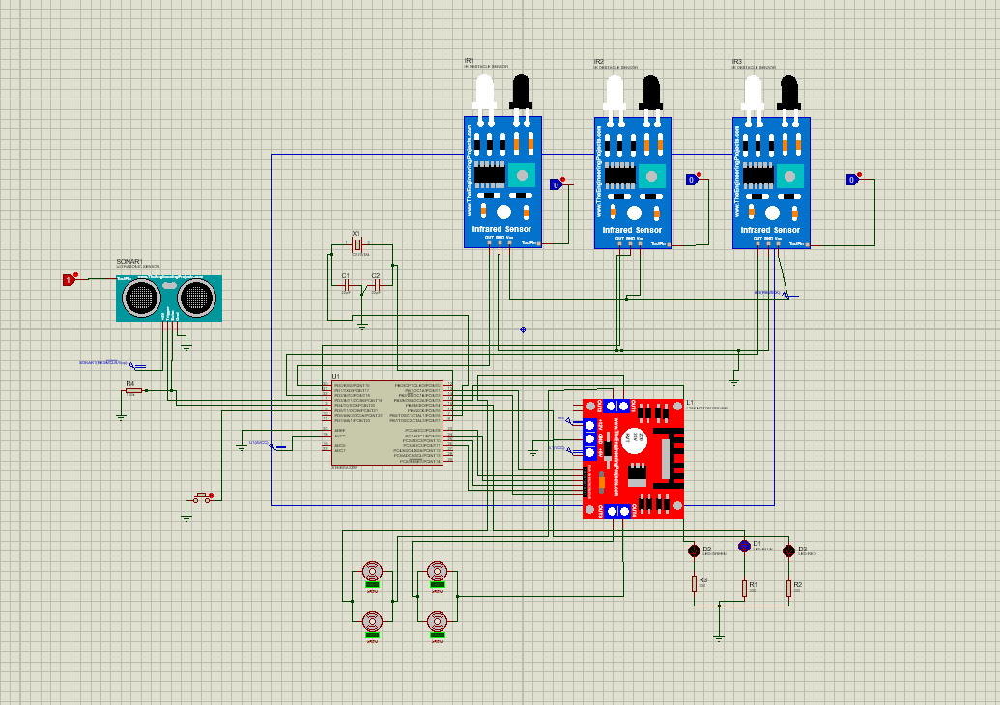

# University of colombo faculty of technology 
# Microcontroler  
# LineFollowing & Obstacle detection Car 


<p align="center">
  
</p>


# Line Follower + Obstacle Stop (ATmega328P)

Low-cost two-wheel robot that follows a black line using two IR reflectance sensors and stops when an HC-SR04 ultrasonic sensor detects an obstacle within a set distance. Built around ATmega328P, L298N  motor driver, and 18650 battery pack.

<video src="https://github.com/Thanuskanth19/Linefollowing-robot-and-obstacle-detection./blob/main/Assets/Linefollowing%20live%20link.mp4" controls width="720"></video>


## Features
- Two modes: **Line Follow** and **Line + Obstacle Stop** (toggle via button)
- PWM motor control (right/left), differential turning
- Non-blocking 1 kHz control loop using timer interrupts
- Ultrasonic echo timing via external interrupt
- Status LEDs (mode + obstacle alert)

## Hardware
- ATmega328P (Arduino Uno–compatible or bare chip)
- Motor driver: L298N / TB6612FNG
- 2 × gear motors + wheels
- 2 × IR line sensors (digital output)
- HC-SR04 ultrasonic sensor
- 18650 battery pack + switch
- Misc: perfboard/PCB, wires, LEDs, push button

## Wiring (match to your code)
- Motor ENA/ENB → PWM pins
- Motor IN1..IN4 → digital pins
- IR_LEFT, IR_RIGHT → digital inputs with pull-ups
- HC-SR04 TRIG → digital out | ECHO → external interrupt pin
- LEDs + Mode Button → any spare pins (button with pull-up)

> See `hardware/wiring.md` for the exact pin map you used.

<p align="center">
  
</p>


## Firmware
- Language: C (AVR-GCC) / Arduino-compatible
- Clock: 16 MHz
- Timers:
  - TMR0: Fast PWM for motors
  - TMR2: 1 kHz control loop (ISR) for line logic & LED blink
  - TMR1: 2 MHz timebase for ultrasonic echo width
- External INT0 used for rising/falling edge capture

### Build & Flash (AVR-GCC example)
```bash
avr-gcc -mmcu=atmega328p -DF_CPU=16000000UL -Os -o build/main.elf firmware/src/main.c
avr-objcopy -O ihex -R .eeprom build/main.elf build/main.hex
avrdude -p m328p -c usbasp -U flash:w:build/main.hex:i
